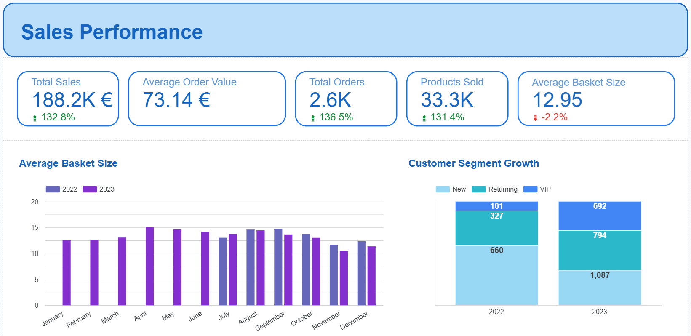

# Case Study: dbt + Looker Analytics Pipeline for Customer & Sales Intelligence

This project demonstrates the design and implementation of a modular analytics engineering stack using **dbt and Looker**, built to transform raw transactional data into a reliable analytics layer for customer behavior and sales performance analysis across 2022–2023.

The system delivers:
• a structured and tested **data warehouse model (dbt)**
• a reusable **semantic layer (LookML)**
• and an interactive **dashboard (Looker Studio)**

Key focus areas include:
• layered data modeling (staging → intermediate → marts)
• reusable business logic (customer segmentation, order metrics)
• data quality testing and validation
• BI-ready semantic definitions

---

## Problem Statement

The objective of this project was to design an analytics system that enables:

• analysis of customer lifecycle behavior (New, Returning, VIP)
• tracking of sales performance across 2022–2023
• consistent KPI definitions across reporting layers

The raw dataset lacked:
• standardized structure across tables
• reusable transformation logic
• analytical modeling for BI consumption

---

## Data Architecture & Design

The project follows a layered **dbt architecture** designed to ensure modularity, scalability, and maintainability.

### Staging Layer
Raw source tables were standardized in:
• `stg_orders`
• `stg_sales`

These models:
• normalize field names and data types
• define a consistent analytical grain
• provide a clean interface over raw sources

This ensures downstream models are not dependent on source system inconsistencies.

---

### Intermediate Layer
Reusable business logic is centralized in intermediate models:

• `int_order_quantity`
• `int_customer_segment`

These models:
• encapsulate transformations used across multiple analyses
• prevent duplication of logic
• serve as a semantic bridge between staging and marts

---

### Mart Layer
Final analytical tables are exposed through:

• `fct_orders`
• `fct_sales`

These marts are optimized for BI consumption and are designed to support:
• performance analysis
• customer analytics
• product-level reporting

---

## Key Analytical Logic

### Customer Segmentation

Customer behavior is modeled using a **12-month trailing rolling window at the order grain**, calculating prior purchase frequency per customer.

This metric is used to classify customers into:
• New
• Returning
• VIP

based on historical purchase behavior intensity.

---

## Looker Studio Dashboard

I designed the Looker Studio dashboard to expose key metrics from Exercises 1–6 in a cohesive analytical narrative.

The dashboard highlights:
• KPI performance trends
• customer behavior differences
• revenue evolution across 2022–2023

---

## Semantic Layer (LookML)

A LookML semantic layer was implemented to ensure consistent metric definitions across all dashboards and users.

Two domain-specific explores were created:

• `fct_orders`: customer and revenue analytics  
• `fct_sales`: product-level performance analytics  

This separation enables modular analysis across business domains while maintaining consistent definitions for key metrics such as:
• average order value
• revenue per customer
• product-level contribution

---

## Data Quality & Testing Strategy

To ensure reliability of transformations, dbt schema tests were implemented across all layers:

• uniqueness constraints on primary keys
• non-null validation for critical dimensions
• referential integrity between staging and intermediate models

These tests ensure data consistency and prevent silent failures in downstream analytics workflows.

---

## Project Organization

    root
    ├── analyses
    │   ├── exercise_1.sql
    │   ├── exercise_2.sql
    │   ├── exercise_3.sql
    │   ├── exercise_4.sql
    │   ├── exercise_5.sql
    │   └── exercise_6.sql
    ├── images
    ├── lookml_project
    │   ├── models
    │   │    └── astrafy.model.lkml
    │   └── views
    │        ├── fct_orders.view.lkml
    │        └── fct_sales.view.lkml
    ├── macros
    │   └── generate_schema_name.sql
    ├── models
    │   ├── intermediate
    │   │    ├── int_customer_segments.sql
    │   │    ├── int_customer_segment.yml
    │   │    ├── int_order_quantity.sql
    │   │    └── int_order_quantity.yml
    │   ├── marts
    │   │    ├── fct_orders.sql
    │   │    └── fct_sales.sql
    │   └── staging
    │        ├── sources.yml
    │        ├── stg_orders.sql
    │        └── stg_sales.yml
    ├── .gitignore
    ├── dbt_project.yml
    └── README.md