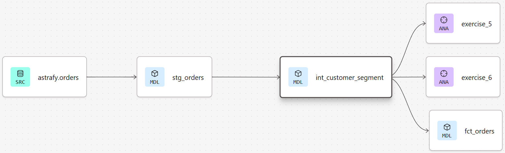

The files in this repository present my solutions to the coding and LookML challenges
for the Data Analyst Engineer role at Astrafy. The coding challenge solutions can be
found under the analyses folders and the lookML files can be found under the 
lookml_project folder. The folder structure and .sql files were all developed in dbt
to facilitate version control, replicability, and auditability. There are a few
tests as well that I designed in .yml files to ensure data integrity at different
stages of development.

## Project Organization
    root
    ├── analyses # contains the .sql files for the coding exercises
    │   ├── exercise_1.sql
    │   ├── exercise_2.sql
    │   ├── exercise_3.sql
    │   ├── exercise_4.sql
    │   ├── exercise_5.sql
    │   └── exercise_6.sql
    ├── images # images used in the readme.md file
    ├── lookml_project
    │   ├── models # explores
    │   │    └── astrafy.model.lkml # explores for fct_orders and fct_sales
    │   └── views # defines dimensions and exposes measures
    │        ├── fct_orders.view.lkml
    │        └── fct_sales.view.lkml
    ├── macros # .sql to be executed by dbt
    │   └── generate_schema_name.sql # ensures the correct dataset name is created
    ├── models # sql used to create staging, intermediate, and marts
    │   ├── intermediate # .sql and .yml files for creation and testing
    │   │    ├── int_customer_segments.sql
    │   │    ├── int_customer_segment.yml
    │   │    ├── int_order_quantity.sql
    │   │    └── int_order_quantity.yml
    │   ├── marts # .sql used to generate the fact tables to be exposed to Looker
    │   │    ├── fct_orders.sql
    │   │    └── fct_sales.sql
    │   └── staging # source configuration and staging files
    │        ├── sources.yml
    │        ├── stg_orders.sql
    │        └── stg_sales.yml    
    ├── .gitignore
    └── README.md

## Coding Challenge

In order to answer the sets of questions the coding challenges required, I decided it was better
to create to reference tables, int_customer_segment.sql and int_order_quantity.sql, because
these tables were reused multiple times with the sql to answer the questions.

### Exercises 1-4

The main table used to query everything from was generated by first querying the
stg_sales table to get the sum of qty grouped by order_id to get qty_product.
qty_product is the number of products for each unique order from 2022-2023.
After that it was a straight forward solution to query the specific measures
the coding challenges asked for, such as total number of orders in 2023 and so on.

### Exercise 5-6

