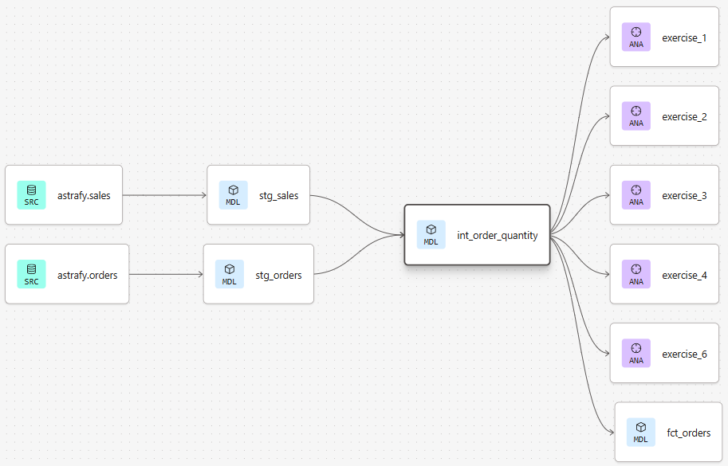

# Case Study: dbt + Looker Analytics Pipeline for Customer & Sales Intelligence

This project demonstrates the design and implementation of a modular analytics engineering stack using **dbt and Looker**, built to transform raw transactional data into a reliable analytics layer for customer behavior and sales performance analysis across 2022–2023.

The system delivers: 
• a structured and tested **data warehouse model (dbt)** 
• a reusable **semantic layer (LookML)** 
• and an interactive **dashboard (Looker Studio)** 

Key focus areas include: 
• layered data modeling (staging → intermediate → marts) 
• reusable business logic (customer segmentation, order metrics) 
• data quality testing and validation 
• BI-ready semantic definitions

---

## Problem Statement

The objective of this project was to design an analytics system that enables: 
• analysis of customer lifecycle behavior (New, Returning, VIP) 
• tracking of sales performance across 2022–2023 
• consistent KPI definitions across reporting layers  

The raw dataset lacked: 
• standardized structure across tables 
• reusable transformation logic 
• analytical modeling for BI consumption

---

## Data Architecture & Design

The project follows a layered **dbt architecture** designed to ensure modularity, scalability, and maintainability.

### Staging Layer

Raw source tables were standardized in: 
• `stg_orders` 
• `stg_sales`  

These models: 
• normalize field names and data types 
• define a consistent analytical grain 
• provide a clean interface over raw sources 

This ensures downstream models are not dependent on source system inconsistencies.

---

### Intermediate Layer
Reusable business logic is centralized in intermediate models: 
• `int_order_quantity` 
• `int_customer_segment`  

These models: 
• encapsulate transformations used across multiple analyses 
• prevent duplication of logic 
• serve as a semantic bridge between staging and marts

---

### Mart Layer
Final analytical tables are exposed through: 
• `fct_orders` 
• `fct_sales`  

These marts are optimized for BI consumption and are designed to support: 
• performance analysis 
• customer analytics 
• product-level reporting

---

## Applied Modeling (Business Logic Implementation)

The following transformations demonstrate how the analytical requirements were implemented using dbt.
These models represent the operationalization of the architecture described above, translating business requirements into reusable transformation logic.

### Order-Level Metrics (Exercises 1–4)

This model aggregates sales data at the order grain to compute product quantities and support downstream revenue and order-based analysis.
It establishes a reusable foundation for all order-level KPIs used across the project.

### Customer Segmentation (Exercises 5–6)

Customer segmentation is computed using a 12-month trailing window at the order grain, capturing historical purchase behavior per customer.

This logic enables classification into: 
• New 
• Returning 
• VIP  

and is reused across both BI dashboards and semantic layer definitions.

---

## Looker Studio Dashboard

I designed the Looker Studio dashboard to expose key metrics from Exercises 1–6 in a cohesive analytical narrative.

The dashboard highlights: 
• KPI performance trends 
• customer behavior differences 
• revenue evolution across 2022–2023 

---

## Semantic Layer (LookML)

A LookML semantic layer was implemented to ensure consistent metric definitions across all dashboards and users.

Two domain-specific explores were created: 
• `fct_orders`: customer and revenue analytics   
• `fct_sales`: product-level performance analytics    

This separation enables modular analysis across business domains while maintaining consistent definitions for key metrics such as: 
• average order value 
• revenue per customer 
• product-level contribution 

---

## Data Quality & Testing Strategy

To ensure reliability of transformations, dbt schema tests were implemented across all layers: 
• uniqueness constraints on primary keys 
• non-null validation for critical dimensions 
• referential integrity between staging and intermediate models  

These tests ensure data consistency and prevent silent failures in downstream analytics workflows.

---

## Project Organization

    root
    ├── analyses # contains the sql used to solve coding challenges
    │   ├── exercise_1.sql
    │   ├── exercise_2.sql
    │   ├── exercise_3.sql
    │   ├── exercise_4.sql
    │   ├── exercise_5.sql
    │   └── exercise_6.sql
    ├── images # contains images used in readme.md
    ├── lookml_project # contains the relevant .lkml files for explores and exposing dimensions/measures
    │   ├── models
    │   │    └── astrafy.model.lkml
    │   └── views
    │        ├── fct_orders.view.lkml
    │        └── fct_sales.view.lkml
    ├── macros # ensures consistent database naming
    │   └── generate_schema_name.sql
    ├── models # contains models and tests used in the dbt pipeline
    │   ├── intermediate
    │   │    ├── int_customer_segments.sql
    │   │    ├── int_customer_segment.yml
    │   │    ├── int_order_quantity.sql
    │   │    └── int_order_quantity.yml
    │   ├── marts
    │   │    ├── fct_orders.sql
    │   │    └── fct_sales.sql
    │   └── staging
    │        ├── sources.yml
    │        ├── stg_orders.sql
    │        └── stg_sales.sql
    ├── .gitignore
    ├── dbt_project.yml
    └── README.md